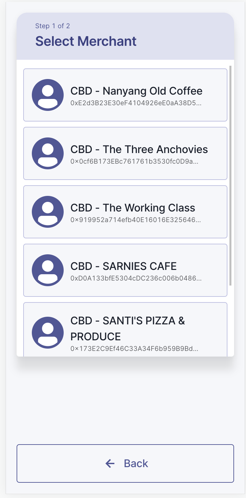

# Government Vouchers

## Problem Statement
### Context
OGP previously built RedeemSG, a Government voucher distribution system used to carry out voucher campaigns such as CDC Vouchers, NEA Vouchers, OTH Vouchers. Through working on these voucher campaigns, we have identified these challenges faced by both the public and private sector.

### High cost of implementing voucher schemes
For every voucher scheme implemented by the Government (and also businesses), Campaign organisers would need to work out from scratch a host of implementation details. They would need to figure out, for example, where vouchers should be spent at; how to disburse the vouchers; how to reconcile transactions with vouchers redeemed. As a result of this, it could take months or in some cases years from the time that a scheme is conceived to the time it is being implemented. 

To improve the efficiency of tracking each process, several merchants/ campaign organizers have taken to commissioning their own voucher system to be able to issue vouchers and track redemptions.  This custom system, based on anecdotes, could cost Campaign organizers thousands or millions to build. 

### Settlement processing is slow and costly
Slow and costly settlement processing is the result of multiple parties each having to do their own reconciliation process. The voucher issuer needs to ensure that the amount paid to the merchants is equal to the amount of vouchers collected back from the merchants, the merchants need to ensure the amount received from the voucher issuer is equal to the amount of vouchers they collected from the Residents, the voucher issuer’s bank needs to ensure that the cash settlement from their bank to all the merchants’ banks are accurate, each of the merchants’ banks need to ensure the cash received from the voucher issuer’s bank are accurate. A reconciliation mismatch between any party would lead to a long and costly dispute resolution process.

### High cost of contracting for each scheme
When there’s a new voucher scheme, the agency needs to reach out to each merchant to onboard them to the scheme. Even if these agencies are already using RedeemSG, and granting an existing merchant in RedeemSG system access to a new voucher scheme can already be done, the merchant still needs to sign a separate contract as the voucher conditions and issuer are different.

## Motivations
We plan to design a protocol where vouchers with conditions can be issued to Residents but at the same time, upon voucher payment, merchants directly receive cash. By doing so, we eliminate the need to onboard merchants for each voucher scheme as the merchants no longer receive vouchers, thus, exposing them to the voucher issuer’s default risk. 
We also want to address the reconciliation issue by having a single ledger serving as the source of truth that is immutable, time and date-stamped and is transparent to all parties involved. This system should also contain an audit trail to provide instant traceability if there’s a dispute between any 2 parties.
The design should be able to accomodate most of the government’s voucher campaign complex requirements.

## Requirements

Through talking to more than 20 Government agency Campaign Organizer , the RedeemSG team identified some core requirements for government voucher campaigns: 

1. Government vouchers are organized in terms of specific schemes, or in RedeemSG terms “Voucher Campaigns” run by “Campaign Organizers”. 
2. Typically, requirements should apply consistently throughout a ‘voucher campaign’ to ensure each recipient receives the same (e.g. within the same scheme, a recipient always gets $50) 
3. Vouchers can be created for monies earmarked by the Government Campaign Organizer, where the Sum of Total Vouchers is less than or equal to the monies set aside
4. Vouchers can be redeemed at specific merchants - this is required especially in the public good context, where Government provides funds towards a certain public good objective (e.g. vouchers to promote healthy living should be spent only at participating merchants with healthy food) 
5. Merchants should be reimbursed quickly, once the voucher is redeemed. 
6. The amount for which the merchant is reimbursed should be 
7. Voucher expiry date is applied

## Goals

As part of the CBDC retail trial, OGP aims to achieve the following goals:

### Demonstrating faster payouts to merchants
This is achieved as merchants directly receive Digital SGDs (DSGD) for any vouchers redeemed. While we are aware of the caveat that the DSGD ecosystem has to be fully developed first to achieve this overall ambition, it will still be helpful in informing how this ecosystem should be designed and developed in future trials

### Demonstrating feasibility of adopting smart contracts for Government campaigns 
Government campaign organisers should be able to easily define and enforce their voucher logic (e.g. targeted merchants, specific timeframe) and issue vouchers to their targeted users.

If vouchers are used outside of the terms of the smart contract (e.g. at merchants not participating in the scheme), the transaction should fail. 

### Demonstrating interoperability for voucher schemes
In the long term, recipients should have the freedom to choose their own wallet applications to access Government issued PBM tokens. Campaign organisers should also be able to easily specify their own required voucher logic, without the need to re-invent existing voucher systems

### Ease of conversion between DSGD and SGD
This is needed to promote the use of DSGD. As DSGD is not legal tender yet, we would need an efficient way to convert DSGD back to SGD to pay the merchants.

## Goals
### Most optimal ‘performance’ in each transaction
While we seek to select a tech solution that would deliver the fastest performance possible, we acknowledge that the transaction speed would still be dependent on factors such as how congested the network is, and how long it takes to confirm a transaction/ block (e.g. through proof of stake for Polygon or proof-of-work for ethereum). To overcome transaction speed limitations of the blockchain of choice requires further exploration. 

### Optimal user experience for how recipients will transact at merchants
In the government context, developing this would require further iteration from the product team. We also foresee that as mentioned above, people should eventually use their Wallet apps to interact with PBM. 

As part of the trial, we have also scoped the trial towards strictly digital vouchers. While paper vouchers are still a critical aspect in enabling inclusive government cash disbursement plans, this will not be a focus for this current trial.

### Ensuring inclusivity for those without phones 
While ensuring inclusivity is typically a goal for government disbursement plans, at this prototype stage we focus on developing a fully digital flow for simplicity. Offline transactions/ developing a fallback to paper vouchers are not catered for. 

### Ensuring 99.99% reliability in transactions 
Given the focus of the trial is simply to validate the feasibility of the PBM/DSGD concept, and the scope of the trial involves vouchers distributed to staff, at this stage the product does not deliver critical government programmes. Therefore, we will not be able to gracefully handle situations where the network (or its infrastructures) is down, for example. 

## Solution

For the context of this trial, we have partnered with the Development Bank of Singapore (DBS) as a bank partner for realising the DSGD segment and making the SGD payments back to the merchants. 

### High Level Overview

### Core Decisions
#### User Initiated Flow
As mentioned above, inclusivity is not a key goal of this trial so we have also scoped the trial towards strictly digital vouchers. Under this new scope, we have modified the user flow from that of the RedeemSG solution. 

In our existing RedeemSG solution, transactions are designed to be merchant-initiated:

1. Vouchers act as offers that have no recipient. Redemptions, transactions and the voucher recipients are created and defined at the point of redemption by voucher redeemers
2. Vouchers have a fixed value attached to them, as part of cross compatibility with paper vouchers

In this new approach, we decided against the traditional RedeemSG flow, in place of a user-initiated one - akin to existing payment solutions such as PAYNOW. We made this change with the assumption, at this juncture, that there would be no paper fallback for vouchers.This also opens up the possibility of future integrations with SGQR - a well adopted, unified payment QR code scheme. 

#### Wallet Based Approach
Since the focus area has been scoped towards digital vouchers, we found that it made more sense to offer a fungible wallet concept, since it allows for a greater degree of freedom for users to utilise their vouchers. Ideally, we would want to approach the mission of achieving purpose being binded to money, rather than set denominations of vouchers. We will discuss in greater detail for future improvements in this design in section 8.2.3

#### System complexity hidden from the Merchants
Another core design decision made was to keep the concept of PBMs completely opaque to merchants. In this approach, merchants need not have any knowledge of PBM tokens, instead receiving only DSGDs. This approach is similar to that of RedeemSG, where merchants are only concerned with payouts to their bank accounts, rather than the underlying mechanics of the voucher scheme they are part of. 

## Parties and Accounts
This section discusses the various pirates and stakeholders involved in this trial. 

| Parties | Accounts |
| --- | --- |
| DBS - Digital Fiat Issuer | **Crypto Wallet**   Digital Fiat issuer will create their own Crypto Wallet |
| OGP - PBM Issuer | **Crypto Wallet**   OGP will create their own Crypto Wallet to store DSGD and PBM tokens   **Bank Account**   OGP will need a bank account to purchase DSGD |
| Members of the Public - PBM Recipient  | **Crypto Wallet**   OGP will create the Crypto Wallet for the OGP staff. |
| Merchants - DSGD Recipient  | **Crypto Wallet**    DBS will create a Crypto Wallet for the merchant    OGP will onboard each merchant to Redeem System   Crypto Wallet address is mapped to their DBS bank account   **Bank Account**   Merchant will own a DBS Bank Account |

## Smart Contracts
### Digital SGD (DSGD) contract 
A contract for the DSGD token that maintains all the DSGD related logic.

### PBM Contract
A contract for managing the PBM tokens. PBM tokens are essentially wrapped DSGD tokens, where purpose logic is wrapped on the underlying DSGD token. 

## Processes
### Crypto on-ramp 
A crypto on-ramp is a system that allows for economic value to flow from fiat money into crypto assets. It’s a series of steps users can take to exchange fiat for crypto. The Digital Fiat Issuer will operate this service by allowing a PBM Issuer to swap out their fiat currency (SGD) for DSGD. To operationalize this activity, the Digital Fiat Issuer would initialise the DSGD smart contract and mint DSGD. The Digital Fiat Issuer is responsible to ensure that DSGD is backed by SGD with a 1:1 pegging ratio, any SGD used by the PBM Issuer will be earmarked to ensure the peg.

For our trial, OGP would fund his DBS Bank Account. Upon receipt of the fiat funds, DBS will earmark the SGD in OGP’s bank account and transfer the respective amount in DSGD to OGP’s crypto wallet.

### PBM Wrapping and Minting
PBM Minting involves the wrapping of DSGD tokens with an embedded custom logic which forms the purpose aspect of the PBM. Here, PBM issuers will first have to generate a smart contract (PBM Contract) and set up the desired redemption logic, pegging ratio, as well as providing the required DSGD tokens to be escrowed by the contract. In the context of this trial, the logic is scoped to merchant list, expiry date and campaign metadata - which form the main requirements in 8.2.2. 

For each PBM mint, an equivalent amount of DSGD is held in the PBM contract, functioning as a decentralised escrow. These funds are held and remain unclaimed until

1. A redemption within the logic specified (ie; approved merchant list) is being made
2. Timelock for campaign expiry is reached

The processes mentioned above will be streamlined, simplified and made more accessible through a separate version of RedeemSG’s campaign organiser portal. The outcome of this is similar to what we are currently doing for the CDC campaign, where we have vouchers offered to residents. These vouchers have an expiry date and can only be used on an approved merchant list. The main difference now is that the enforcing logic is hosted on a trustless contract in the blockchain, as compared to a trusted central server.

### PBM Unwrapping & DSGD Fulfilment
As mentioned in the previous steps, the PBM contract functions as a trustless and transparent escrow in the fulfilment of PBM to DSGD tokens. PBM tokens are only unwrapped into DSGD once the correct redemption requirements, specified by the issuer, takes place. 

The following explains the steps taken for unwrapping during a successful PBM token redemption

1. DSGD tokens that are escrowed in the PBM contract by the issuer is released to the PBM recipient (ie; merchant)
2. PBM tokens used for redemption (from receiver/caller) are automatically burned from the caller’s wallet to reduce the overall PBM token supply and maintain PBM to DSGD pegging.

For our trial, OGP personnel would go down to a merchant, purchase an item and use a web application to make “payment” to the merchant. Upon pressing “Pay”, PBM tokens will be deducted from their crypto wallet and DSGD will be added to the merchant’s crypto wallet following the aforementioned 3 step process orchestrated by the PBM contract.

### Crypto off-ramp
A crypto off-ramp is the exact reverse of an on-ramp. It’s a mechanism that allows for economic value to flow from crypto assets back into fiat money. It's the side of the bridge that allows users to cash out of crypto. The Digital Fiat Issuer will operate this service by allowing a PBM Issuer/DSGD Recipient to swap out their DSGD for fiat currency (SGD). The Digital Fiat Issuer is responsible to ensure that they are able to fulfil all off-ramp requests. This is done by burning DSGD and transferring the SGD equivalent from the previously earmarked account, ensuring the 1:1 pegging ratio at all times.

For our trial, DBS will run a daily job to burn all DSGD from the merchant’s crypto wallet and transfer the SGD equivalent back to the merchant’s bank account.

The outcome of this is similar to what we are currently doing for the CDC campaign where at the end of each day, we will tally all the vouchers collected from each merchant and send the respective SGD to the merchant’s bank account via FAST.

## User Journey
### PBM Issuer Experience
As described in previous sections, token minting requires the issuer to shore up for an equivalent amount of DSGD. Essentially, issuers will need to already have the required DSGD tokens that they wish to wrap a purpose to. The following illustrates the token flow.

### PBM Receiver Experience
#### Onboarding
The voucher (PBM) recipient will sign up for the campaign with the PBM Issuer. The PBM Issuer will then create a Crypto Wallet for him and map this wallet to his NRIC. The voucher (PBM) recipient will then be sent a unique voucher link via SMS. This voucher link will contain his wallet information.

#### Payment
The transaction experience will be similar to that of a typical online payment flow, as follows: 

He would open a web app, select the PBM token amount and select the shop he wants to make payment too. There are 2 methods of selecting the recipient: 1) Select the shop name from a drop down list, 2) Scan the merchant QR code. Once done, the user will be brought to the payment confirmation screen and he will ensure the amount and recipient is accurate before pressing “confirm”. Once done, the PBM tokens will be transferred to the PBM contract and the PBM contract will release the corresponding DSGD to the merchant’s wallet. He will then receive a confirmation message showing the Amount, Shop Name, Date and Time. This confirmation message will be shown to the PBM Recipient and used as proof of payment. PBM Recipient can also check his transaction history for proof of payment.

**Payment Flow**

**Merchant View**

**Select Amount and Shop**

**Confirm Payment and Receive Success Message**

The interaction between the PBM recipient, the merchant contract and the token contract are as follows:

#### PBM Recipient Experience
**Onboarding**
Merchant would sign up with OGP. OGP will send the merchant’s bank account number to DBS for the creation of their Crypto Wallet. After creation, the Wallet address will be returned to OGP and these addresses will be added to the “approved” merchant list within the PBM contract. OGP will send a unique link to the merchant via SMS. Once done, when a user makes a payment, the PBM contract will validate whether the merchant address is in the “approved” list and approve or reject the transaction.

#### Payouts
DBS will handle the conversion of DSGD back to SGD. At the end of the day, DBS will run a job and transfer all the DSGD from the merchant’s crypto wallet back to their crypto wallet. Afterwhich, they will proceed to burn the DSGD and release the SGD earmarked and transfer it to the Merchant’s Bank Account.

## Technical Design

### Design Choices
| Category | Design Choice | Rationale |
|---|---|---|
| Permissioned vs Permissionless Networks  | In the context of the trial, a permissionless network is used, which is readily available and publicly accessible  |  For the trial, we are relatively flexible towards the type of network used. The main rationale for utilising already available permissionless chain is to provide easier interoperability with other projects within this paper, that have also been geared towards public use    Additionally, public networks are also much easier to develop for, given that no additional networking infrastructures or access control policies are required. This helps to reduce the barrier of entry for collaboration amongst other participants within this paper. |
| Permissionless Network Choice | We will be utilising a Permissionless Polygon network for this trial.     UAT testing was done on the Mumbai Testnet and production deployment was on Polygon Mainnet | There are a few solutions in the public and permissionless chain space. Ideally, the network choice should be compatible with the system’s usage patterns, where transactions are ideally fast and relatively low-value. This also equates to an acceptable level of gas prices to reflect these use cases.     Polygon compliments this by offering a sidechain that is sufficiently reliable, cheap and  well supported by 3rd party services.     The network of choice should also be ideally EVM compatible, where it is sufficiently easy to develop for. Solidity has become one of, if not, the most popular language of choice for smart contract development. |
| Pegging | We adopted a collateralized approach to ensure the 1:1 pegging ratio holds for the SGD-DSGD peg and the DSGD-PBM token peg, we ensured that 1) the total DSDG in circulation = the total SGD in earmarked, 2) the total PBM token in circulation = the total DSGD held in the PBM contract address | For pegging between SGD to DSGD, we are earmarking the respective fiat to back the DSGD token.   For pegging between DSGD to PBM Token, we are putting the DSGD into the PBM contract address, which serves as an escrow account to back the PBM Token.   We felt that this was the safest way to ensure SGD-DSGD and DSGD- PBM token will not depeg.     We also explored some non-collateralized approaches but felt that it was not as effective.| 
| PBM Tokens Conditions | **Campaign expiry date**   Once the campaign expires, all the PBM token will be converted to DSGD and send back back to Campaign organizer’s wallet    **Merchant list**   Only approved merchant wallets will be allowed to receive DSGD from that PBM token (Ring Fencing redemptions)| Technically any business logic can be added to the PBM contract, we are just showcasing these 2 as these are the commonly required business logic in Government. |
| Interoperability (DSGD) | Smart contracts were written in Solidity and using the popular ERC standards. We settled with the ERC20 standard since it is the most popular ERC standard, and the best representation of fungible tokens. | **DSGD can interoperate with both Government and Commercial Issued PBM Tokens**   When building the DSGD smart contract, we also ensured that it can be easily interoperable between both commercial and government use cases (eg; Xfers, Grab, OGP)    Ideally, this base DSGD contract should offer familiar interfaces for other stakeholders to integrate with. The ERC20 standards and extensions offer the required functionality to enable many of the design requirements that a wrapping PBM token can utilise    In the future, we hope to merge all of the various DSGD token implementations.|
| Crypto Custody | PBM Recipient’s crypto wallet private keys will be stored and managed by OGP, private keys accessible by user    DSGD Recipient’s crypto wallet private keys will be stored and managed by DBS, private keys not accessible by user| Wallet and private key management still remains a UX problem in the web3 space, requiring either an additional app or an extension. For this trial, we are looking towards removing wallet management on the part of the voucher recipient    We wanted to abstract away the concept of interacting with the blockchain from the user’s point of view.     We also do not want the users to manage their private keys.    That said, we still have the ability to release the user’s private keys if he plans to use a 3rd party application |

### Comparisons

In general, we considered the 3 most popular token standards that have sufficient support with popular wallet providers. 

1. ERC20 - A fungible token standard
2. ERC721 - A non-fungible token standard
3. ERC1155 - A multi-token standard

ERC721 was eliminated due to lack of support for a fungible wallet approach, as discussed in core decisions

|Token Standards|Main Concept|Pros|Cons|
|---|---|---|---|
|ERC-20|1 smart contract per campaign    Accounts based, with no fixed denominations|Easier to manage and make modification - more granular approach and custom functionalities can be done more easily should it be requested by an organiser     Lower risk of contract bloating     Easier for campaign specific mechanisms (eg; pausing per campaign)     Clearer ownership model, with owner being the campaign organiser. RedeemSG only provides the factory and platform to easily create these contracts. Contracts are also modelled directly to existing concept of a campaign|Wasteful, most campaigns share the same interface either way, unnecessary deployments are being made per campaign if same interface     Contracts are distributed across multiple addresses, need to implement an additional aggregator/address discovery service|
|ERC-1155|1 smart contract for all campaigns, akin to a platform contract     Allows support for both NFT-based ( ERC721) and wallet based (ERC20) approaches|Follow the paper vouchers concept with support for NFTs    Better for a decentralised approach. If we're allowing users to manage their own wallets, a new NFT transferred to them will immediately appear on their metamask wallet. Hence, lesser work needed to be done by the end user     Better design for token/campaigns that share same logic requirements|More complexity, which equates to potentially more vulnerabilities and gas requirements. Contract is more lethargic to logical changes.      The contract infrastructures required to enable this might lead to more gas consumption in the long run (eg; looking up state for permissions, interacting with separate storage contracts etc.)|

### Implementation
The following describes the high level overview for the contract design. 

The current scope of contract logic is scoped primarily to current known requirements from redeemSG - where merchant list, expiry date  and necessary campaign metadata can be specified. Given the less rigid design, it is also possible to customise this logic in the foreseeable future. 

A more thorough discussion will be done in the technical discussion. 

## Conclusion
### Achievement of trial goals 
|Goal|How the goal is achieved|Areas to be worked through|
|---|---|---|
|Demonstrating faster payouts to merchants|Merchants receive DSGD directly once a voucher transaction takes place, as the PBM converts directly into DSGD as per the logic of the PBM smart contract. |While merchants receive DSGD immediately, for DSGD to be immediately useful, it would need to be accepted more widely.   This requires it either to be more widely in circulation, for there to be a healthy ecosystem around it, or for legislation to formally designate it as legal tender.|
|Demonstrating feasibility of adopting smart contracts for Government campaigns|We have demonstrated that it is indeed feasible to use the mechanism of PBM smart contract to achieve the goals of Government campaign organizers’ requirements - such as ensuring PBM token/ voucher expiry and targeting specific merchants.  |While it is technically possible to provide PBM issuers with the ability to write and deploy their own smart contracts via a contract factory, it is unclear what the wider adoption would look like.   For instance, not all PBM issuers will have the technical capability to do so. To promote wider adoption, we may have to provide a portal through which PBM issuers specify their contract requirements, and to provide PBM “templates” that make it easier for the PBM issuer. |
|Demonstrating interoperability for voucher schemes|As mentioned above, while building the DSGD smart contract, we did ensure it is easily interoperable between government and commercial use cases and that recipients still can access the same tokens via crypto Wallet apps.|For wider roll out across singapore, there should ideally be the same token standard across commercial and private use cases - e.g. whether it be ERC 20 or ERC 1155. The choice of what token standard would work best for Retail CBDC is something that would need to be worked through.|
|Ease of conversion between DSGD and SGD|As mentioned above, this is achieved as the DSGD Issuer (in this case DBS) handles the conversion on the merchant’s behalf of DSGD back to SGD at the end of the day via a batch job. |Ideally, the DSGD Issuer could explore ways in which the conversion could be done on a more real time basis. |
|Feasible migration to Web3 Infrastructures|Generally, the migration has been demonstrated to be relatively feasible, with added caveats. Operating costs as a voucher management platform provider (ie; RedeemSG) went down as a result of this migration. |We also found that the same guarantees for transaction reliability went down when adopting a public/permissionless networking approach. A great deal of monitoring is done to :   1. Ensure transactions reach a consistent state   2. Ensure users have sufficient gas in place of network congestions   There are also additional UX challenges that surfaced with the permissionless approach, with some harbouring on the topics of user privacy and convenience    Most of these are existing challenges that we would like to tackle in future stages of the trial. We have outlined some actionable improvements in the next section.|

### Future Improvements
Going forwards, we also hope to offer the following improvements

**Reconsideration of network architectures**

Re-evaluate the selection of a permission network, which mitigates many of the complications that come with a public and permissionless setup.

**Providing better user experience (UX)**

Handling gas fee management with Gas Station Network (GSN). Ideally the users should not need to manage gas consumption, given the need reducing complexities on the part of voucher recipients

Providing adequate transaction relay mechanisms to reduce the need for resolving more complex edge cases during transaction delivery - eg; stuck transactions. These are concerns that should be addressed as we scale beyond the scope of this trial. 

**Providing support for offline vouchers**

The government use case has the added concern for inclusivity. Ideally, paper vouchers should still be supported in the future, considering the current state of digital savviness of the older sections of the population. Systems have to be designed to be inclusive, in order to be viable, since purpose based money often comes with the main concern of providing relief to specific segments of the population.

**Adoption of ERC1155**

An ERC1155 contract would serve as the sole platform contract that stores all the PBM tokens across multiple PBM Issuers. In future iterations, we hope to solidify the campaign organiser requirements and further refine the required contract interfaces for government agencies. This brings about the potential for a platform contract to manage all government voucher/PBM campaigns that can further streamline PBM token creations for different government agencies.
Offering options for token fungibility. ERC1155 is able to support both NFT and FT standards that may be useful for certain campaigns that may require support for paper vouchers or fixed denomination spending. 

### Future Work
**Integration with government wallet providers**

Exploration integration and implementation of government wallet providers that are closely associated with the national digital identity movement, opening up potential for easily crediting PBMs based on user identity and recipient requirements -  such as means testing.

**Integration with PAYNOW**

With PAYNOW integration, we would have a mapping between the NRIC/UEN with a crypto wallet address. By doing so, when a user scans the SGQR, he would be able to select whether he wants to transaction SGD via FAST (current payment rails), or DSGD via this new payment rail. With that, the team would not need to handle merchant onboarding. As long as a merchant is onboarded to PAYNOW, and has a crypto wallet address, the PBM Recipients would be able to make payments in their shop.

**Integration with commercial wallet providers**

We have plans to work with the commercial wallet providers such GrabPay, DBS PayLah!, etc to allow the PBM recipients to access and use their PBM Tokens from a commercial wallet provider of their choice.

